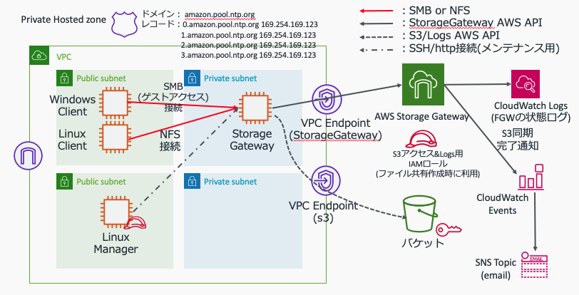
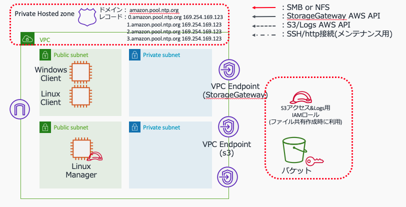

# StorageGateway検証環境
一般的なストレージゲートウェイの検証環境(VPCEndpointあり)を構築する手順

# 作成環境
<center></center>

# 作成手順
## (1)事前設定
### (1)-(a) 作業環境の準備
下記を準備します。
* bashが利用可能な環境(LinuxやMacの環境)
* aws-cliのセットアップ
* AdministratorAccessポリシーが付与され実行可能な、aws-cliのProfileの設定

### (1)-(b) CLI実行用の事前準備
これ以降のAWS-CLIで共通で利用するパラメータを環境変数で設定しておきます。
```shell
export PROFILE=<設定したプロファイル名称を指定。デフォルトの場合はdefaultを設定>
export REGION=ap-northeast-1
```

## (2)VPCの作成(CloudFormation利用)
IGWでインターネットアクセス可能で、パブリックアクセス可能なサブネットx2、プライベートなサブネットx2の合計4つのサブネットを所有するVPCを作成します。
<center></center>

### (2)-(a)テンプレートのダウンロード
私が作成し利用しているVPC作成用のCloudFormationテンプレートを利用します。まず、githubからテンプレートをダウンロードします。
```shell
curl -o vpc-4subnets.yaml https://raw.githubusercontent.com/Noppy/CfnCreatingVPC/master/vpc-4subnets.yaml
```
### (2)-(b)VPC作成
ダウンロードしたテンプレートを利用し、VPCをデプロイします。
```shell
CFN_STACK_PARAMETERS='
[
  {
    "ParameterKey": "DnsHostnames",
    "ParameterValue": "true"
  },
  {
    "ParameterKey": "DnsSupport",
    "ParameterValue": "true"
  },
  {
    "ParameterKey": "InternetAccess",
    "ParameterValue": "true"
  },
  {
    "ParameterKey": "EnableNatGW",
    "ParameterValue": "false"
  },
  {
    "ParameterKey": "VpcName",
    "ParameterValue": "StorageGWPoCVPC"
  },
  {
    "ParameterKey": "VpcInternalDnsName",
    "ParameterValue": "sgwpoc.local."
  }
]'

aws --profile ${PROFILE} cloudformation create-stack \
    --stack-name SGWPoC-VPC \
    --template-body "file://./vpc-4subnets.yaml" \
    --parameters "${CFN_STACK_PARAMETERS}" \
    --capabilities CAPABILITY_IAM ;
```
## (2) VPCEndpoint設定
必要となるVPC Endpointを作成します。
<center></center>

### (2)-(a) 構成情報取得
```shell
#構成情報取得
VPCID=$(aws --profile ${PROFILE} --output text \
    cloudformation describe-stacks \
        --stack-name SGWPoC-VPC \
        --query 'Stacks[].Outputs[?OutputKey==`VpcId`].[OutputValue]')

VPC_CIDR=$(aws --profile ${PROFILE} --output text \
    cloudformation describe-stacks \
        --stack-name SGWPoC-VPC \
        --query 'Stacks[].Outputs[?OutputKey==`VpcCidr`].[OutputValue]')

PublicSubnet1Id=$(aws --profile ${PROFILE} --output text \
    cloudformation describe-stacks \
        --stack-name SGWPoC-VPC \
        --query 'Stacks[].Outputs[?OutputKey==`PublicSubnet1Id`].[OutputValue]')

PublicSubnet2Id=$(aws --profile ${PROFILE} --output text \
    cloudformation describe-stacks \
        --stack-name SGWPoC-VPC \
        --query 'Stacks[].Outputs[?OutputKey==`PublicSubnet2Id`].[OutputValue]')

PrivateSubnet1Id=$(aws --profile ${PROFILE} --output text \
    cloudformation describe-stacks \
        --stack-name SGWPoC-VPC \
        --query 'Stacks[].Outputs[?OutputKey==`PrivateSubnet1Id`].[OutputValue]')

PrivateSubnet2Id=$(aws --profile ${PROFILE} --output text \
    cloudformation describe-stacks \
        --stack-name SGWPoC-VPC \
        --query 'Stacks[].Outputs[?OutputKey==`PrivateSubnet2Id`].[OutputValue]')

PrivateSubnet1RouteTableId=$(aws --profile ${PROFILE} --output text \
    cloudformation describe-stacks \
        --stack-name SGWPoC-VPC \
        --query 'Stacks[].Outputs[?OutputKey==`PrivateSubnet1RouteTableId`].[OutputValue]')

PrivateSubnet2RouteTableId=$(aws --profile ${PROFILE} --output text \
    cloudformation describe-stacks \
        --stack-name SGWPoC-VPC \
        --query 'Stacks[].Outputs[?OutputKey==`PrivateSubnet2RouteTableId`].[OutputValue]')

echo -e "VPCID=$VPCID\nVPC_CIDR=$VPC_CIDR\nPublicSubnet1Id =$PublicSubnet1Id\nPublicSubnet2Id =$PublicSubnet2Id\nPrivateSubnet1Id=$PrivateSubnet1Id\nPrivateSubnet2Id=$PrivateSubnet2Id\nPrivateSubnet1RouteTableId=$PrivateSubnet1RouteTableId \nPrivateSubnet2RouteTableId=$PrivateSubnet2RouteTableId"
```
### (2)-(b) VPC: VPCEndpointの作成
```shell
#VPC Endpoint用SecurityGroup作成
VPCENDPOINT_SG_ID=$(aws --profile ${PROFILE} --output text \
    ec2 create-security-group \
        --group-name VpcEndpointSG \
        --description "Allow https" \
        --vpc-id ${VPCID}) ;

aws --profile ${PROFILE} \
    ec2 create-tags \
        --resources ${VPCENDPOINT_SG_ID} \
        --tags "Key=Name,Value=VpcEndpointSG" ;

aws --profile ${PROFILE} \
    ec2 authorize-security-group-ingress \
        --group-id ${VPCENDPOINT_SG_ID} \
        --protocol tcp \
        --port 443 \
        --cidr ${VPC_CIDR} ;

#Storage Gateway専用のSecurityGroup作成
VPCENDPOINT_STORAGEGW_SG_ID=$(aws --profile ${PROFILE} --output text \
    ec2 create-security-group \
        --group-name SGW-VpcEndpointSG \
        --description "Allow https" \
        --vpc-id ${VPCID}) ;

aws --profile ${PROFILE} \
    ec2 create-tags \
        --resources ${VPCENDPOINT_STORAGEGW_SG_ID} \
        --tags "Key=Name,Value=SGW-VpcEndpointSG" ;

# AWS API通信
aws --profile ${PROFILE} \
    ec2 authorize-security-group-ingress \
        --group-id ${VPCENDPOINT_STORAGEGW_SG_ID} \
        --protocol tcp \
        --port 443 \
        --cidr ${VPC_CIDR} ;

# for support channel
aws --profile ${PROFILE} \
    ec2 authorize-security-group-ingress \
        --group-id ${VPCENDPOINT_STORAGEGW_SG_ID} \
        --protocol tcp \
        --port 22 \
        --cidr ${VPC_CIDR} ;

aws --profile ${PROFILE} \
    ec2 authorize-security-group-ingress \
        --group-id ${VPCENDPOINT_STORAGEGW_SG_ID} \
        --protocol tcp \
        --port 1026-1028 \
        --cidr ${VPC_CIDR} ;

aws --profile ${PROFILE} \
    ec2 authorize-security-group-ingress \
        --group-id ${VPCENDPOINT_STORAGEGW_SG_ID} \
        --protocol tcp \
        --port 1031 \
        --cidr ${VPC_CIDR} ;

aws --profile ${PROFILE} \
    ec2 authorize-security-group-ingress \
        --group-id ${VPCENDPOINT_STORAGEGW_SG_ID} \
        --protocol tcp \
        --port 2222 \
        --cidr ${VPC_CIDR} ;

#S3用VPCEndpoint作成
aws --profile ${PROFILE} \
    ec2 create-vpc-endpoint \
        --vpc-id ${VPCID} \
        --service-name com.amazonaws.${REGION}.s3 \
        --route-table-ids ${PrivateSubnet1RouteTableId} ${PrivateSubnet2RouteTableId}

#StorageGateway用VPCEndpoint作成
aws --profile ${PROFILE} \
    ec2 create-vpc-endpoint \
        --vpc-id ${VPCID} \
        --vpc-endpoint-type Interface \
        --service-name com.amazonaws.${REGION}.storagegateway \
        --subnet-id ${PrivateSubnet1Id} ${PrivateSubnet2Id} \
        --security-group-id ${VPCENDPOINT_STORAGEGW_SG_ID} ;

#SSM用PCEndpoint作成
aws --profile ${PROFILE} \
    ec2 create-vpc-endpoint \
        --vpc-id ${VPCID} \
        --vpc-endpoint-type Interface \
        --service-name com.amazonaws.${REGION}.ssm \
        --subnet-id ${PrivateSubnet1Id} ${PrivateSubnet2Id} \
        --security-group-id ${VPCENDPOINT_SG_ID} ;

aws --profile ${PROFILE} \
    ec2 create-vpc-endpoint \
        --vpc-id ${VPCID} \
        --vpc-endpoint-type Interface \
        --service-name com.amazonaws.${REGION}.ec2messages \
        --subnet-id ${PrivateSubnet1Id} ${PrivateSubnet2Id} \
        --security-group-id ${VPCENDPOINT_SG_ID} ;

aws --profile ${PROFILE} \
    ec2 create-vpc-endpoint \
        --vpc-id ${VPCID} \
        --vpc-endpoint-type Interface \
        --service-name com.amazonaws.${REGION}.ssmmessages \
        --subnet-id ${PrivateSubnet1Id} ${PrivateSubnet2Id} \
        --security-group-id ${VPCENDPOINT_SG_ID} ;
```
## (3) Storage Gateway管理用のIAMロール(管理サーバ用)作成
```shell
POLICY='{
  "Version": "2012-10-17",
  "Statement": [
    {
      "Sid": "",
      "Effect": "Allow",
      "Principal": {
        "Service": "ec2.amazonaws.com"
      },
      "Action": "sts:AssumeRole"
    }
  ]
}'
#IAMロールの作成
aws --profile ${PROFILE} \
    iam create-role \
        --role-name "Ec2-StorageGW-AdminRole" \
        --assume-role-policy-document "${POLICY}" \
        --max-session-duration 43200

#AWS管理ポリシー(AWSStorageGatewayFullAccess)のアタッチ
aws --profile ${PROFILE} \
    iam attach-role-policy \
        --role-name "Ec2-StorageGW-AdminRole" \
        --policy-arn arn:aws:iam::aws:policy/AWSStorageGatewayFullAccess

#インスタンスプロファイルの作成
aws --profile ${PROFILE} \
    iam create-instance-profile \
        --instance-profile-name "Ec2-StorageGW-AdminRole-Profile";

aws --profile ${PROFILE} \
    iam add-role-to-instance-profile \
        --instance-profile-name "Ec2-StorageGW-AdminRole-Profile" \
        --role-name "Ec2-StorageGW-AdminRole" ;
```
## (4) Windows/Linuxクライアント、Linux-Manager作成
<center></center>

### (4)-(a) セキュリティーグループ作成(Bastion)
(i) Client - SSHログイン用 Security Group
```shell
# SSHログイン用セキュリティーグループ作成
SSH_SG_ID=$(aws --profile ${PROFILE} --output text \
    ec2 create-security-group \
        --group-name SshSG \
        --description "Allow ssh" \
        --vpc-id ${VPCID}) ;

aws --profile ${PROFILE} \
    ec2 create-tags \
        --resources ${SSH_SG_ID} \
        --tags "Key=Name,Value=SshSG" ;

# セキュリティーグループにSSHのinboundアクセス許可を追加
aws --profile ${PROFILE} \
    ec2 authorize-security-group-ingress \
        --group-id ${SSH_SG_ID} \
        --protocol tcp \
        --port 22 \
        --cidr 0.0.0.0/0 ;
```
(ii) Client - RDPログイン用 Security Group
```shell
# RDPログイン用セキュリティーグループ作成
RDP_SG_ID=$(aws --profile ${PROFILE} --output text \
    ec2 create-security-group \
        --group-name RdpSG \
        --description "Allow rdp" \
        --vpc-id ${VPCID}) ;

aws --profile ${PROFILE} \
    ec2 create-tags \
        --resources ${RDP_SG_ID} \
        --tags "Key=Name,Value=RdpSG" ;

# セキュリティーグループにRDPのinboundアクセス許可を追加
aws --profile ${PROFILE} \
    ec2 authorize-security-group-ingress \
        --group-id ${RDP_SG_ID} \
        --protocol tcp \
        --port 3389 \
        --cidr 0.0.0.0/0 ;
```
(iii) Client識別用 Security Group
```shell
# クライアント識別用セキュリティーグループ作成
CLIENT_SG_ID=$(aws --profile ${PROFILE} --output text \
    ec2 create-security-group \
        --group-name ClientSG \
        --description "Allow rdp" \
        --vpc-id ${VPCID}) ;

aws --profile ${PROFILE} \
    ec2 create-tags \
        --resources ${CLIENT_SG_ID} \
        --tags "Key=Name,Value=ClientSG" ;
```
(iv) Manager - SSHログイン用 Security Group
```shell
# SSHログイン用セキュリティーグループ作成
MGR_SSH_SG_ID=$(aws --profile ${PROFILE} --output text \
    ec2 create-security-group \
        --group-name Mgr-SshSG \
        --description "Allow ssh" \
        --vpc-id ${VPCID}) ;

aws --profile ${PROFILE} \
    ec2 create-tags \
        --resources ${MGR_SSH_SG_ID} \
        --tags "Key=Name,Value=Mgr-SshSG" ;

# セキュリティーグループにSSHのinboundアクセス許可を追加
aws --profile ${PROFILE} \
    ec2 authorize-security-group-ingress \
        --group-id ${MGR_SSH_SG_ID} \
        --protocol tcp \
        --port 22 \
        --cidr 0.0.0.0/0 ;
```
(iiv) セキュリティーグループ設定情報の確認
```shell
SSH_SG_ID=$(aws --profile ${PROFILE} --output text \
        ec2 describe-security-groups \
                --filter 'Name=group-name,Values=SshSG' \
        --query 'SecurityGroups[].GroupId');

RDP_SG_ID=$(aws --profile ${PROFILE} --output text \
        ec2 describe-security-groups \
                --filter 'Name=group-name,Values=RdpSG' \
        --query 'SecurityGroups[].GroupId');

CLIENT_SG_ID=$(aws --profile ${PROFILE} --output text \
        ec2 describe-security-groups \
                --filter 'Name=group-name,Values=ClientSG' \
        --query 'SecurityGroups[].GroupId');

MGR_SG_ID=$(aws --profile ${PROFILE} --output text \
        ec2 describe-security-groups \
                --filter 'Name=group-name,Values=Mgr-SshSG' \
        --query 'SecurityGroups[].GroupId');

#設定情報の表示
echo -e "SSH_SG_ID   =${SSH_SG_ID}\nRDP_SG_ID   =${RDP_SG_ID}\nCLIENT_SG_ID=${CLIENT_SG_ID}\nMGR_SG_ID   =${MGR_SG_ID}"

```
### (4)-(b)インスタンス作成用の事前情報取得
```shell
KEYNAME="CHANGE_KEY_PAIR_NAME"  #環境に合わせてキーペア名を設定してください。  

#最新のAmazon Linux2のAMI IDを取得します。
AL2_AMIID=$(aws --profile ${PROFILE} --output text \
    ec2 describe-images \
        --owners amazon \
        --filters 'Name=name,Values=amzn2-ami-hvm-2.0.????????.?-x86_64-gp2' \
                  'Name=state,Values=available' \
        --query 'reverse(sort_by(Images, &CreationDate))[:1].ImageId' ) ;

WIN2019_AMIID=$(aws --profile ${PROFILE} --output text \
    ec2 describe-images \
        --owners amazon \
        --filters 'Name=name,Values=Windows_Server-2019-Japanese-Full-Base-????.??.??' \
                  'Name=state,Values=available' \
        --query 'reverse(sort_by(Images, &CreationDate))[:1].ImageId' ) ;
echo -e "KEYNAME=${KEYNAME}\nAL2_AMIID=${AL2_AMIID}\nWIN2019_AMIID=${WIN2019_AMIID}"
```
### (4)-(c) Liunux-Client作成
```shell
#インスタンスタイプ設定
#INSTANCE_TYPE="t2.micro"
INSTANCE_TYPE="m5d.8xlarge"

#タグ設定
TAGJSON='
[
    {
        "ResourceType": "instance",
        "Tags": [
            {
                "Key": "Name",
                "Value": "Linux-Client"
            }
        ]
    }
]'

#ユーザデータ設定
USER_DATA='
#!/bin/bash -xe
                
yum -y update
yum -y install bind bind-utils
hostnamectl set-hostname Linux-Client
'
# サーバの起動
aws --profile ${PROFILE} \
    ec2 run-instances \
        --image-id ${AL2_AMIID} \
        --instance-type ${INSTANCE_TYPE} \
        --key-name ${KEYNAME} \
        --subnet-id ${PublicSubnet1Id} \
        --security-group-ids ${SSH_SG_ID} ${CLIENT_SG_ID}\
        --associate-public-ip-address \
        --tag-specifications "${TAGJSON}" \
        --user-data "${USER_DATA}" ;
```
### (4)-(d) Windows-Client作成
```shell
#インスタンスタイプ設定
#INSTANCE_TYPE="t2.micro"
INSTANCE_TYPE="m5d.8xlarge"

#タグ設定
TAGJSON='
[
    {
        "ResourceType": "instance",
        "Tags": [
            {
                "Key": "Name",
                "Value": "Windows-Client"
            }
        ]
    }
]'

# サーバの起動
aws --profile ${PROFILE} \
    ec2 run-instances \
        --image-id ${WIN2019_AMIID} \
        --instance-type ${INSTANCE_TYPE} \
        --key-name ${KEYNAME} \
        --subnet-id ${PublicSubnet1Id} \
        --security-group-ids ${RDP_SG_ID} ${CLIENT_SG_ID}\
        --associate-public-ip-address \
        --tag-specifications "${TAGJSON}" ;
```
### (4)-(e) Manager(Linux)の作成
```shell
#インスタンスタイプ設定
INSTANCE_TYPE="t2.micro"

#タグ設定
TAGJSON='
[
    {
        "ResourceType": "instance",
        "Tags": [
            {
                "Key": "Name",
                "Value": "Manager-Linux"
            }
        ]
    }
]'
#ユーザデータ設定
USER_DATA='
#!/bin/bash -xe
                
yum -y update
yum -y install bind bind-utils
hostnamectl set-hostname Mgr-linux
'
# サーバの起動
aws --profile ${PROFILE} \
    ec2 run-instances \
        --image-id ${AL2_AMIID} \
        --instance-type t2.micro \
        --key-name ${KEYNAME} \
        --subnet-id ${PublicSubnet2Id} \
        --security-group-ids ${MGR_SSH_SG_ID}\
        --associate-public-ip-address \
        --tag-specifications "${TAGJSON}" \
        --user-data "${USER_DATA}" \
        --iam-instance-profile "Name=Ec2-StorageGW-AdminRole-Profile";
```
## (5) StorageGateway作成(事前準備)
Storage Gatewayで利用するS3のバケットと、S3アクセス用にStorage Gatewayが利用するIAMロールを作成します。
<center></center>

### (5)-(a) StorageGateway用のSecurityGroup作成
(i) SGW用 Security Group
```shell
# セキュリティーグループID取得

#Security Group ID取得
CLIENT_SG_ID=$(aws --profile ${PROFILE} --output text \
        ec2 describe-security-groups \
                --filter 'Name=group-name,Values=ClientSG' \
        --query 'SecurityGroups[].GroupId');

MGR_SG_ID=$(aws --profile ${PROFILE} --output text \
        ec2 describe-security-groups \
                --filter 'Name=group-name,Values=Mgr-SshSG' \
        --query 'SecurityGroups[].GroupId');

echo -e "CLIENT_SG_ID=${CLIENT_SG_ID}\nMGR_SG_ID   =${MGR_SG_ID}"

# SGW用セキュリティーグループ作成
SGW_SG_ID=$(aws --profile ${PROFILE} --output text \
    ec2 create-security-group \
        --group-name SGWSG \
        --description "Allow gateway" \
        --vpc-id ${VPCID}) ;

aws --profile ${PROFILE} \
    ec2 create-tags \
        --resources ${SGW_SG_ID} \
        --tags "Key=Name,Value=StorageGWSG" ;

# セキュリティーグループにStorageGatewayに必要となるinboundアクセス許可を追加
# gatewayへのアクティベーションコード取得のため
aws --profile ${PROFILE} \
    ec2 authorize-security-group-ingress \
        --group-id ${SGW_SG_ID} \
        --protocol tcp \
        --port 80 \
        --source-group ${MGR_SG_ID} ;

# gatewayへのコンソールログインのため
aws --profile ${PROFILE} \
    ec2 authorize-security-group-ingress \
        --group-id ${SGW_SG_ID} \
        --protocol tcp \
        --port 22 \
        --source-group ${MGR_SG_ID} ;

# クライアントとのSMB接続(1)
aws --profile ${PROFILE} \
    ec2 authorize-security-group-ingress \
        --group-id ${SGW_SG_ID} \
        --protocol tcp \
        --port 139 \
        --source-group ${CLIENT_SG_ID} ;

# クライアントとのSMB接続(2)
aws --profile ${PROFILE} \
    ec2 authorize-security-group-ingress \
        --group-id ${SGW_SG_ID} \
        --protocol tcp \
        --port 445 \
        --source-group ${CLIENT_SG_ID} ;

# クライアントとのNFS接続(1) NFS
aws --profile ${PROFILE} \
    ec2 authorize-security-group-ingress \
        --group-id ${SGW_SG_ID} \
        --protocol tcp \
        --port 2049 \
        --source-group ${CLIENT_SG_ID} ;

# クライアントとのNFS接続(2) rpcbind/sunrpc for NFSv3
aws --profile ${PROFILE} \
    ec2 authorize-security-group-ingress \
        --group-id ${SGW_SG_ID} \
        --protocol tcp \
        --port 111 \
        --source-group ${CLIENT_SG_ID} ;

# クライアントとのNFS接続(3) gensha for NFSv3
aws --profile ${PROFILE} \
    ec2 authorize-security-group-ingress \
        --group-id ${SGW_SG_ID} \
        --protocol tcp \
        --port 20048 \
        --source-group ${CLIENT_SG_ID} ;
```
### (5)-(b) StorageGateway用S3バケット作成
```shell
BUCKET_NAME="storagegw-bucket-$( od -vAn -to1 </dev/urandom  | tr -d " " | fold -w 10 | head -n 1)"
REGION=$(aws --profile ${PROFILE} configure get region)

aws --profile ${PROFILE} \
    s3api create-bucket \
        --bucket ${BUCKET_NAME} \
        --create-bucket-configuration LocationConstraint=${REGION};
```
### (5)-(c) StorageGateway用IAMRole作成
```shell
POLICY='{
  "Version": "2012-10-17",
  "Statement": [
    {
      "Sid": "",
      "Effect": "Allow",
      "Principal": {
        "Service": "storagegateway.amazonaws.com"
      },
      "Action": "sts:AssumeRole"
    }
  ]
}'
#IAMロールの作成
aws --profile ${PROFILE} \
    iam create-role \
        --role-name "StorageGateway-S3AccessRole" \
        --assume-role-policy-document "${POLICY}" \
        --max-session-duration 43200

#In-line Policyの追加
POLICY='{
  "Version": "2012-10-17",
  "Statement": [
    {
      "Sid": "OperatBucket",
      "Effect": "Allow",
      "Action": [
        "s3:GetAccelerateConfiguration",
        "s3:GetBucketLocation",
        "s3:GetBucketVersioning",
        "s3:ListBucket",
        "s3:ListBucketVersions",
        "s3:ListBucketMultipartUploads"
      ],
      "Resource": [
        "arn:aws:s3:::'"${BUCKET_NAME}"'"
      ]
    },
    {
      "Sid": "PuAndGetObject",
      "Effect": "Allow",
      "Action": [
        "s3:AbortMultipartUpload",
        "s3:DeleteObject",
        "s3:DeleteObjectVersion",
        "s3:GetObject",
        "s3:GetObjectAcl",
        "s3:GetObjectVersion",
        "s3:ListMultipartUploadParts",
        "s3:PutObject",
        "s3:PutObjectAcl"
      ],
      "Resource": [
        "arn:aws:s3:::'"${BUCKET_NAME}"'/*"
      ]
    }
  ]
}'
#インラインポリシーの設定
aws --profile ${PROFILE} \
    iam put-role-policy \
        --role-name "StorageGateway-S3AccessRole" \
        --policy-name "AccessS3buckets" \
        --policy-document "${POLICY}";
```

### (5)-(d) NTP接続不可回避用のRoute53 Private Hosted Zone設定
ファイルゲートウェイに設定されているNTPサーバ(同期先)は、インターネット上のNTPサーバ(x.amazon.pool.ntp.org
)である。そのためファイルゲートウェイを、インターネット接続ができない環境に設置した場合、時刻同期処理を行うことができない。そこで、Route53のPrivate Hosted Zoneを活用し、x.amazon.pool.ntp.orgのアクセス先をAWS time sync(169.254.169.123)にアクセスするようにさせる
```shell
#設定
REGION=$(aws --profile ${PROFILE} configure get region)

#Private Hosted zoneの作成
aws --profile ${PROFILE} \
    route53 create-hosted-zone \
        --name "amazon.pool.ntp.org" \
        --caller-reference $(date '+%Y-%m-%d-%H:%M') \
        --vpc VPCRegion=${REGION},VPCId=${VPCID} ;

HOSTED_ZONE_ID=$(aws --profile ${PROFILE} --output text \
    route53 list-hosted-zones-by-name \
        --dns-name "amazon.pool.ntp.org" \
    --query 'HostedZones[].Id' | sed -e 's/\/hostedzone\///') ;

#レコード登録
CHANGE_BATCH_JSON='{
  "Comment": "CREATE NTP records ",
  "Changes": [
    {
      "Action": "CREATE",
      "ResourceRecordSet": {
        "Name": "0.amazon.pool.ntp.org",
        "Type": "A",
        "TTL": 300,
        "ResourceRecords": [
          {
            "Value": "169.254.169.123"
          }
        ]
      }
    },
    {
      "Action": "CREATE",
      "ResourceRecordSet": {
        "Name": "1.amazon.pool.ntp.org",
        "Type": "A",
        "TTL": 300,
        "ResourceRecords": [
          {
            "Value": "169.254.169.123"
          }
        ]
      }
    },
    {
      "Action": "CREATE",
      "ResourceRecordSet": {
        "Name": "2.amazon.pool.ntp.org",
        "Type": "A",
        "TTL": 300,
        "ResourceRecords": [
          {
            "Value": "169.254.169.123"
          }
        ]
      }
    },
    {
      "Action": "CREATE",
      "ResourceRecordSet": {
        "Name": "3.amazon.pool.ntp.org",
        "Type": "A",
        "TTL": 300,
        "ResourceRecords": [
          {
            "Value": "169.254.169.123"
          }
        ]
      }
    }
  ]
}'
#x.amazon.poo..ntp.orgのAレコード登録
aws --profile ${PROFILE} \
    route53 change-resource-record-sets \
            --hosted-zone-id ${HOSTED_ZONE_ID} \
            --change-batch "${CHANGE_BATCH_JSON}";
```

## (6) ファイルゲートウェイの作成
ゲートウェイを作成、アクティベーションして利用可能な状態にします。
<center></center>

### (6)-(a) ファイルゲートウェイ・インスタンスの作成
```shell
# FileGatewayの最新のAMIIDを取得する
FGW_AMIID=$(aws --profile ${PROFILE} --output text \
    ec2 describe-images \
        --owners amazon \
        --filters 'Name=name,Values=aws-storage-gateway-??????????' \
                  'Name=state,Values=available' \
        --query 'reverse(sort_by(Images, &CreationDate))[:1].ImageId' );

#Security Group ID取得
SGW_SG_ID=$(aws --profile ${PROFILE} --output text \
        ec2 describe-security-groups \
                --filter 'Name=group-name,Values=SGWSG' \
        --query 'SecurityGroups[].GroupId');


#ファイルゲートウェイインスタンスの起動
INSTANCE_TYPE=c4.4xlarge
TAGJSON='
[
    {
        "ResourceType": "instance",
        "Tags": [
            {
                "Key": "Name",
                "Value": "Fgw"
            }
        ]
    }
]'
BLOCK_DEVICE_MAPPINGS='[
    {
        "DeviceName": "/dev/xvda",
        "Ebs": {
            "DeleteOnTermination": true,
            "VolumeType": "io1",
            "Iops": 4000,
            "VolumeSize": 350,
            "Encrypted": false
        }
    },
    {
        "DeviceName": "/dev/sdm",
        "Ebs": {
            "DeleteOnTermination": true,
            "VolumeType": "io1",
            "Iops": 1500,
            "VolumeSize": 1024,
            "Encrypted": false
        }
    }
]'

aws --profile ${PROFILE} \
    ec2 run-instances \
        --image-id ${FGW_AMIID} \
        --instance-type ${INSTANCE_TYPE} \
        --key-name ${KEYNAME} \
        --subnet-id ${PrivateSubnet1Id} \
        --security-group-ids ${SGW_SG_ID} \
        --block-device-mappings "${BLOCK_DEVICE_MAPPINGS}" \
        --tag-specifications "${TAGJSON}" \
        --monitoring Enabled=true;
```
### (6)-(b) アクティベーションキーの取得
ファイルゲートウェイから、 アクティベーションキーを取得します。
(i)アクティベーション用のURL作成
```shell
#構成情報取得
GatewayIP=$(aws --profile ${PROFILE} --output text \
    ec2 describe-instances  \
        --filters "Name=tag:Name,Values=Fgw" "Name=instance-state-name,Values=running" \
    --query 'Reservations[*].Instances[*].PrivateIpAddress' )
REGION=$(aws --profile ${PROFILE} configure get region)
VPCEndpointDNSname=$(aws --profile ${PROFILE} --output text \
    ec2 describe-vpc-endpoints \
        --filters \
            "Name=service-name,Values=com.amazonaws.ap-northeast-1.storagegateway" \
            "Name=vpc-id,Values=${VPCID}" \
    --query 'VpcEndpoints[*].DnsEntries[0].DnsName' );
echo ${GatewayIP} ${REGION} ${VPCEndpointDNSname}

#アクティベーション先のURL生成
ACTIVATION_URL="http://${GatewayIP}/?gatewayType=FILE_S3&activationRegion=${REGION}&vpcEndpoint=${VPCEndpointDNSname}&no_redirect"
echo ${ACTIVATION_URL}
```
参考
https://docs.aws.amazon.com/ja_jp/storagegateway/latest/userguide/gateway-private-link.html#GettingStartedActivateGateway-file-vpc

(ii)アクティベーションキーの取得<br>
LinuxManager上から、生成したURLでアクティベーションキーを取得します。
### (6)-(c) ゲートウェイのアクティベーション
ファイルゲートウェイをアクティベーションします。
```shell
ACTIVATION_KEY=<取得したアクティベーションキーを入力>
REGION=$(aws --profile ${PROFILE} configure get region)
aws --profile ${PROFILE} \
    storagegateway activate-gateway \
        --activation-key ${ACTIVATION_KEY} \
        --gateway-name SgPoC-Gateway-1 \
        --gateway-timezone "GMT+9:00" \
        --gateway-region ${REGION} \
        --gateway-type FILE_S3

#作成したGatewayのARN取得
# atewayState"が "RUNNING"になるまで待つ
#ARNがわからない場合は、下記コマンドで確認
#aws --profile ${PROFILE} storagegateway list-gateways
aws --profile ${PROFILE} storagegateway describe-gateway-information --gateway-arn <GATEWAYのARN>
```
＜参考 gateway-typeの説明>
- "STORED" : VolumeGateway(Store type)
- "CACHED" : VolumeGateway(Cache tyep)
- "VTL"    : VirtualTapeLibrary
- "FILE_S3": File Gateway

### (6)-(d) ローカルディスク設定
```shell
#ローカルストレージの確認
GATEWAY_ARN=$(aws --profile ${PROFILE} --output text storagegateway list-gateways |awk '/SgPoC-Gateway-1/{ print $4 }')
DiskIds=$(aws --profile ${PROFILE} --output text storagegateway list-local-disks --gateway-arn ${GATEWAY_ARN} --query 'Disks[*].DiskId'| sed -e 's/\n/ /')
echo ${DiskIds}

#ローカルストレージの割り当て
aws --profile ${PROFILE} storagegateway \
    add-cache \
        --gateway-arn ${GATEWAY_ARN} \
        --disk-ids ${DiskIds}

#ローカルストレージの確認
# "DiskAllocationType"が"CACHE STORAGE"で、"DiskStatus"が"present"であることを確認
aws --profile ${PROFILE} --output text \
    storagegateway list-local-disks \
        --gateway-arn ${GATEWAY_ARN}
```
参照：https://docs.aws.amazon.com/ja_jp/storagegateway/latest/userguide/create-gateway-file.html

### (6)-(e) SMB設定(SMBSecurityStrategy)
```shell
GATEWAY_ARN=$(aws --profile ${PROFILE} --output text storagegateway list-gateways |awk '/SgPoC-Gateway-1/{ print $4 }')

aws --profile ${PROFILE} storagegateway \
    update-smb-security-strategy \
        --gateway-arn ${GATEWAY_ARN} \
        --smb-security-strategy MandatoryEncryption
```
### (6)-(f) ゲストアクセス用の SMB ファイル共有を設定
```shell
PASSWORD="HogeHoge@"
aws --profile ${PROFILE} storagegateway \
    set-smb-guest-password \
        --gateway-arn ${GATEWAY_ARN} \
        --password ${PASSWORD}
```
### (6)-(g) SMBファイル共有
```shell
#情報取得
BUCKETARN="arn:aws:s3:::${BUCKET_NAME}" #${BUCKET_NAME}は、バケット作成時に設定した変数
ROLE="StorageGateway-S3AccessRole"
ROLEARN=$(aws --profile  ${PROFILE} --output text \
    iam get-role \
        --role-name "StorageGateway-S3AccessRole" \
    --query 'Role.Arn')
GATEWAY_ARN=$(aws --profile ${PROFILE} --output text storagegateway list-gateways |awk '/SgPoC-Gateway-1/{ print $4 }')
CLIENT_TOKEN=$(cat /dev/urandom | base64 | fold -w 38 | sed -e 's/[\/\+\=]/0/g' | head -n 1)
echo -e "BUCKET=${BUCKETARN}\nROLE_ARN=${ROLEARN}\nGATEWAY_ARN=${GATEWAY_ARN}\nCLIENT_TOKEN=${CLIENT_TOKEN}"

#実行
aws --profile ${PROFILE} storagegateway \
    create-smb-file-share \
        --client-token ${CLIENT_TOKEN} \
        --gateway-arn "${GATEWAY_ARN}" \
        --location-arn "${BUCKETARN}" \
        --role "${ROLEARN}" \
        --object-acl bucket-owner-full-control \
        --default-storage-class S3_STANDARD \
        --guess-mime-type-enabled \
        --authentication GuestAccess
```
